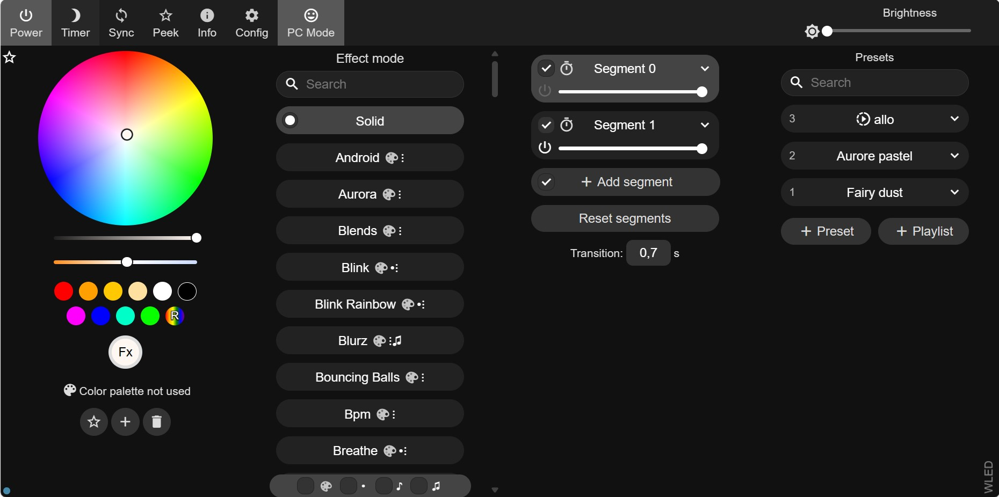

# Wifi Artnet Node
Suite à une exploration avec un module esp-32 et une discussion avec mon proffesseur Guillaume Arseneault j'ai découvert un logiciel nommé WLED qui s'installe rapidement sur un micro controleur esp-32.

## documentation WLED
[lien vers la documention github du projet github](https://github.com/Aircoookie/WLED-Docs)

l'instalation est très simple, il prend en charge le web serial donc pas besoin de télécharger le code et le compiler. Il est possible de seulement brancher le esp-332 en serial et l'instalation se fait via leur site web
[Lien vers l'instalation en webserial](https://kno.wled.ge/)

### Les points forts de cette exploration
- remplace une node pour un coût moindre
- s'execute entièrement en mode "standalone" sur le esp-32, a un ui web et une applicaiton téléphone qui permet de contrôler le module
- permet aussi de recevoir du artnet (tester avec touchdesigner)

## Test rapide
- Quand le esp-32 est débrancher et rebrancher il reboot directement sur le réseau, car il est storé sur la parti préférence du esp-32
- benché avec 2 bande led ws2815 de 300 pixels chacune durant toute la nuit

## ui
via le UI il y a beaucoup de possibilités pour faire des instalations en mode "standalone" et/ou programmer 2-3 cue pour remettre a un clients quelque chose de facile à opérer.

## artnet
https://youtu.be/_EtR9kphh2g

https://youtu.be/wLkKNZu4zoI

Les tests que j'ai effectué avec le artnet on été effectué dans touchdesigner avec 2 bande del ws2815 de 300 px (4 univers).

j'ai tester avec environs 25 pieds de distances et la transmission artnet se faisait bien

